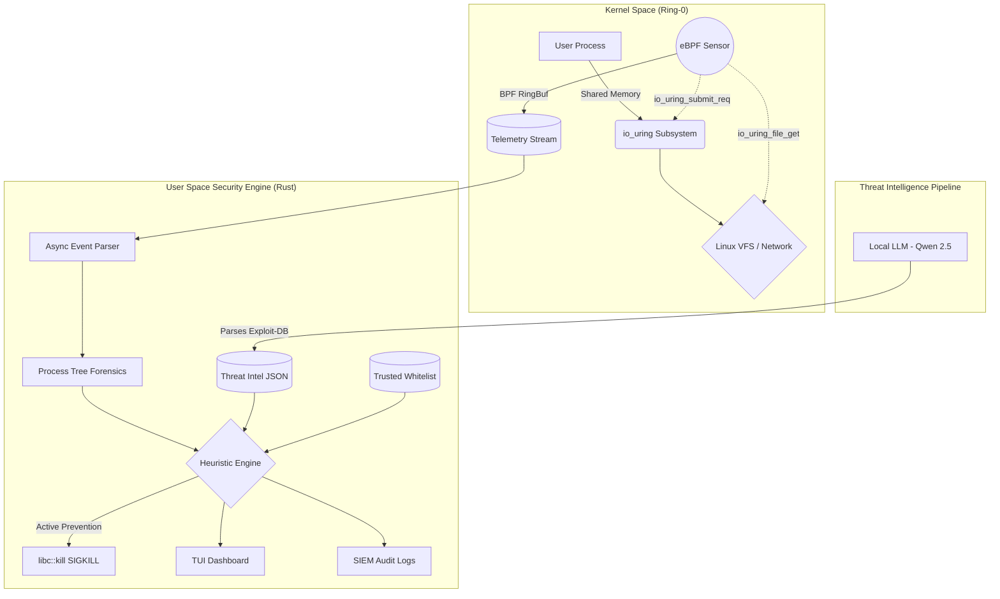

# IORing Guard

IORing Guard is a high-performance, kernel-level Endpoint Detection and Response (EDR) system designed specifically to monitor, detect, and prevent asynchronous Linux kernel exploits originating from the `io_uring` subsystem.

## The Problem

Modern Linux kernels utilize `io_uring` for high-performance, asynchronous I/O. Instead of issuing standard system calls (which are easily monitored by legacy security tools like `auditd` or `seccomp`), user-space applications batch operations into shared memory ring buffers. 

Because traditional security software intercepts standard system calls, they are completely blind to operations executed through `io_uring`. This architectural blind spot has led to a surge in unmonitored Local Privilege Escalation (LPE) exploits (e.g., DirtyPipe), stealth rootkits, and network evasions.

## The Solution

IORing Guard bridges this security gap by deploying eBPF (Extended Berkeley Packet Filter) sensors directly into Ring-0 of the Linux kernel. It hooks into the internal execution paths of the `io_uring` workers, parsing opcodes, memory addresses, and file descriptors before they are committed to the virtual file system or network stack.

The raw kernel telemetry is streamed via BPF Ring Buffers to a high-speed Rust engine in user-space, which cross-references the behavior against a dynamic, JSON-driven Threat Intelligence database.

### Architecture Overview



## Core Features

* **Ring-0 eBPF Interception:** Monitors exact execution structures (`io_kiocb`) in real-time without the performance overhead or blindspots of user-space hooking.
* **Offline AI Signature Generation:** To maintain strict enterprise data privacy, the system utilizes a locally hosted micro-LLM (Qwen 2.5 0.5B). This air-gapped model parses natural language vulnerability reports (such as Exploit-DB entries) and autonomously generates deployable JSON eBPF signatures, eliminating the need to send telemetry to cloud AI providers.
* **Dynamic Threat Intelligence:** Detection rules are fully decoupled from the binary. The Rust engine dynamically loads JSON heuristics to detect LPEs, Data Exfiltration, Network UAFs, and Ransomware behaviors.
* **Process Tree Forensics:** Automatically walks the `/proc` filesystem to reconstruct the parent process ancestry (e.g., `sshd->bash->malware`), providing exact attribution for security analysts.
* **Active Prevention & Rate Limiting:** Capable of operating in Passive Audit mode or Active Prevention mode, where malicious operations trigger sub-millisecond `SIGKILL` signals to assassinate the offending process. Includes a Trusted Binary Whitelist to rate-limit Denial of Service (DoS) queue flooding without impacting legitimate databases.
* **Enterprise SIEM Integration:** All events and mitigations are strictly formatted and exported to standard JSON audit logs for ingestion by platforms like Splunk, Datadog, or Elasticsearch.

## Technical Stack

* **Kernel Space:** eBPF, C
* **User Space Engine:** Rust, Ratatui (TUI Framework)
* **AI Pipeline:** Python, llama-cpp-python, HuggingFace (Qwen 2.5 GGUF)

## Usage

### Prerequisites
* Linux Kernel 5.15+ (with eBPF and io_uring support)
* Rust toolchain
* Clang/LLVM (for compiling eBPF objects)
* Python 3 (for the LLM signature generator)

### Running the EDR
To launch the primary security engine and TUI dashboard:
```bash
sudo ./run.sh
```

### Dashboard Navigation
* `p`: Toggle between Active Prevention and Passive Detection modes.
* `n`: Toggle view between All Events and Alerts Only.
* `c`: Clear the dashboard history.
* `Home` / `End`: Navigate to the newest or oldest events.
* `q`: Exit the application.

### Generating Offline Signatures
To utilize the local LLM for automated signature generation from vulnerability text:
```bash
# Set up the environment
python3 -m venv venv
source venv/bin/activate
pip install llama-cpp-python huggingface-hub

# Run the generator
python3 tools/local_llm_parser.py
```
